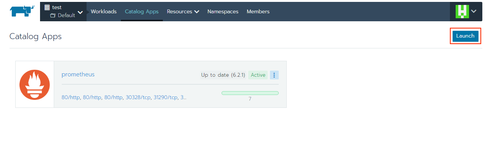
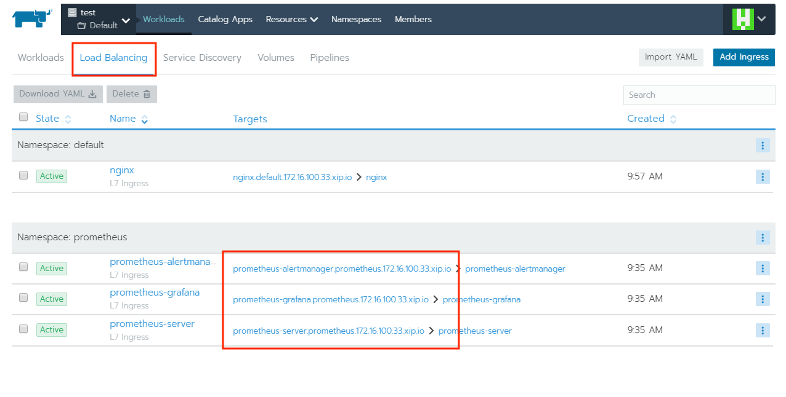
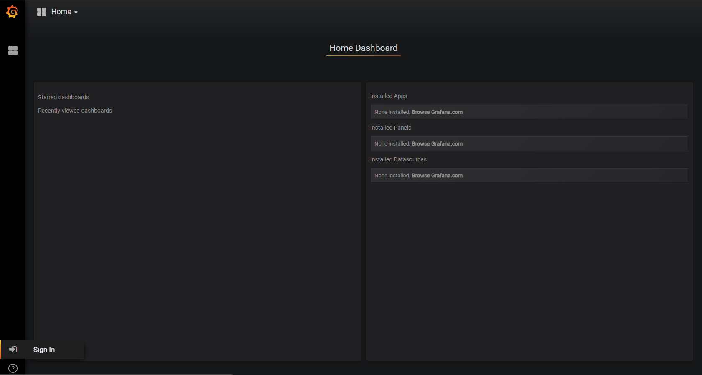
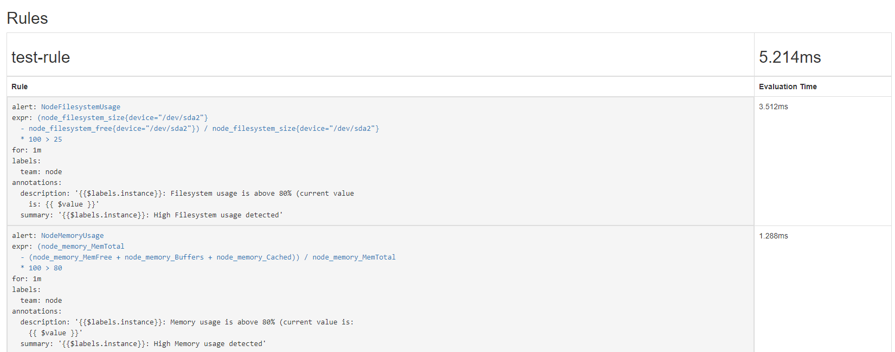

# 監控

## 安裝

### Step1. 準備作業

#### 先檢查有沒有開啟 Rancher 的 Catalog 功能，預設是開啟的


### Step2. 安裝

進入 Cluster -&gt; Project:xx -&gt; Catalog Apps，點選右上角的 Launch


搜尋 prometheus，點下方 View Details


依需求設定，記得設定密碼，完成後按 Launch


等右上角出現 Active 就完成了



到 Workloads 底下的 Load Balancing Tab，中間網址可以連上 Prometheus, grafana, AlertManager 頁面



## grafana

進到頁面後，左下角 Sign in



按左上方的 Home 可以選 Dashboard


## AlertManager

#### prometheus-alertmanageer 的 頁面，可以看到被觸發的警告事件


### Alert Rule 設定

 Peoject-&gt; Resources-&gt; Config Maps 找到 prometheus-server ，按右方三個點 -&gt; Edit


### Alert Rule 格式

* `groups.rules[].alert`  Alert名稱
* `groups.rules[].expr` 監控條件 
* `groups.rules[].for` 符合條件，多久後視為異常狀態
* `groups.rules[].annotations` 警告詳細敘述 \(會顯示在 AlertManager 管理頁面上\)

#### 範例



```yaml
groups:
- name: test-rule
  rules:

 ---
  - alert: NodeFilesystemUsage  # Alert名稱
    # 監控條件
    expr: avg by (instance, kubernetes_name, kubernetes_namespace)((node_filesystem_size{device="/dev/sda2"} - node_filesystem_free{device="/dev/sda2"}) / node_filesystem_size{device="/dev/sda2"} * 100) > 10 
    for: 1m   # 符合條件，多久後視為異常狀態
    labels:
      team: node
    annotations:
      # 警告詳細敘述 (會顯示在 AlertManager 管理頁面上)
      summary: "{{$labels.instance}}: High Filesystem usage detected"
      description: "{{$labels.instance}}: Filesystem usage is above 80% (current value is: {{ $value }}"
  # ----------
  - alert: NodeMemoryUsage
    expr: (node_memory_MemTotal - (node_memory_MemFree+node_memory_Buffers+node_memory_Cached )) / node_memory_MemTotal * 100 > 80
    for: 1m
    labels:
      team: node
    annotations:
      summary: "{{$labels.instance}}: High Memory usage detected"
      description: "{{$labels.instance}}: Memory usage is above 80% (current value is: {{ $value }}"
  # ----------
  - alert: NodeCPUUsage
    expr: (100 - (avg by (instance) (irate(node_cpu{mode="idle"}[5m])) * 100)) > 80
    for: 2m
    labels:
      team: node
    annotations:
      summary: "{{$labels.instance}}: High CPU usage detected"
      description: "{{$labels.instance}}: CPU usage is above 80% (current value is: {{ $value }}"
```



## Prometheus

到 Status -&gt; Rule 可以找到設定的 Alert Rules




