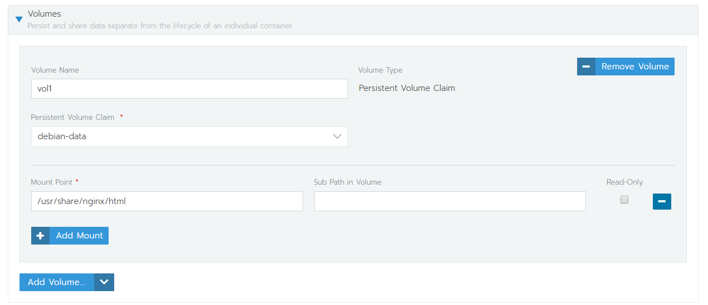

# 掛載資料覆蓋問題

## 主要流程

用 job 功能，建立一個裝有資料的 container1 和一個是要主要的 container2，將他們共同掛載一個 volume，並設定有資料的 container1 啟動時執行 cp 指令複製到 volume 裡面

## 範例

#### 以 nginx 複製 /usr/share/nginx/html 為範例

開一個主要 Pod 並掛上一個 volume



再開一個 Job 右方 Workload Type 選 `Job ，`並掛載與主要 pod 同一個 volume，設定複製的 command


#### 複製 command 範例

```bash
# sample command
mkdir /new_html && 
echo "from data-container 3" >> /new_html/3.html &&  
cp /new_html/* /html-data
```

完成了之後，Job會顯示 succeeded，nginx 掛載的 volume 下面，也會看到複製的資料了，它不會消失可以手動刪除


在掛載的 Volume 中即可看到複製進去的資料

