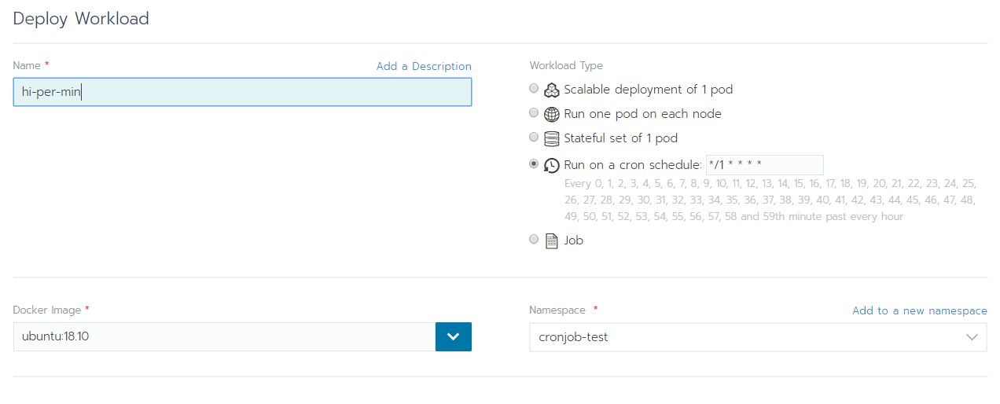

# 排程

Workloads 頁面，右上角 Deploy 

Workload Type 選 `Run on a cron schedule`，設定排程時間



這裡以執行指令為範例


```bash
# sample command
echo "Hi, current time is " && date
```

完成了之後，等排程時間到，就會顯示 succeeded，預設顯示 10 筆執行紀錄


