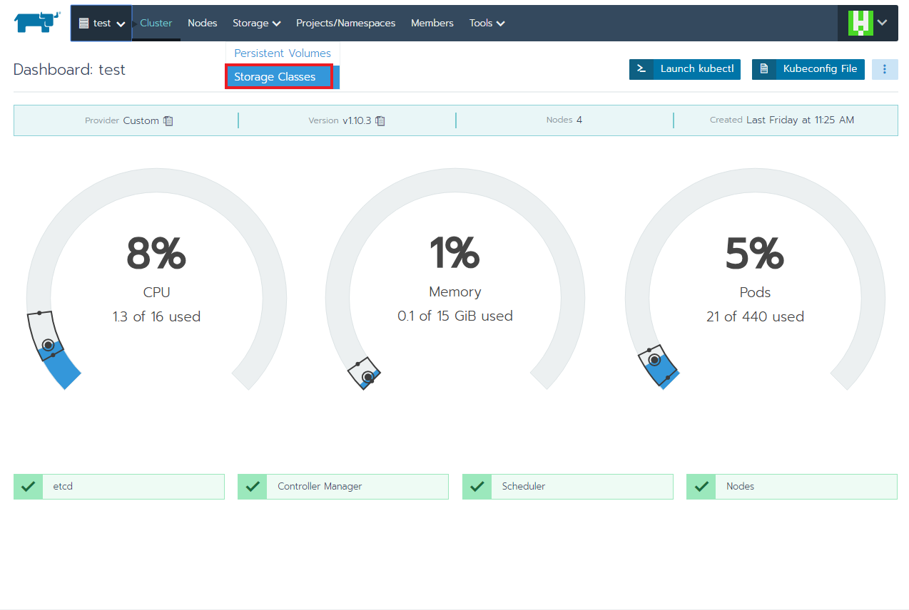

# Volume 設定

## 設定 nfs 當 persistent volume

#### doc: [kubernetes-incubator/external-storage](https://github.com/kubernetes-incubator/external-storage/tree/master/nfs-client)

### Step1. 下載 github Repo

[https://github.com/kubernetes-incubator/external-storage/tree/master/nfs-client](https://github.com/kubernetes-incubator/external-storage/tree/master/nfs-client)

### Step2. 部署

#### 下載 [github repo](https://github.com/kubernetes-incubator/external-storage/tree/master/nfs-client)， 部署以下三個 yaml

* `deploy/auth/serviceaccount.yaml` 
* `deploy/auth/clusterrole.yaml` 
* **`deploy/auth/clusterrolebinding.yaml`**
* **`deploy/deployment.yaml`** 


#### 其中兩個檔案需要修改

* 修改 `clusterrolebinding.yaml` 的 `namespace ，`指定要部署在哪個 `namespace`
* 修改 `deploy/deployment.yaml` 修改其中的：`PROVISIONER_NAME`、`NFS_SERVER`、`NFS_PATH`，`NFS share directory`等資料，有5處需要修改


#### deployment.yaml 範例



```yaml
# deploy/deployment.yaml
# 掛載到 172.16.100.37 的 nfs server 上
# 的 /zfsPool/nfs_share 目錄
# **注意有五處需要修改**
...
...
...
spec:
    serviceAccountName: nfs-client-provisioner
    containers:
    - name: nfs-client-provisioner
        image: quay.io/external_storage/nfs-client-provisioner:latest
        volumeMounts:
        - name: nfs-client-root
            mountPath: /persistentvolumes
        env:
        - name: PROVISIONER_NAME
            value: provisioner-nfs  # **此處需要修改**這個名稱，之後會用到
        - name: NFS_SERVER
            value: 172.16.100.37  # **此處需要修改**
        - name: NFS_PATH
            value: /zfsPool/nfs_share  # **此處需要修改**
    volumes:
    - name: nfs-client-root
        nfs:
        server: 172.16.100.37  # **此處需要修改**
        path: /zfsPool/nfs_share  # **此處需要修改**
```



### Step3. 設定 StorageClass

進到 Rancher-&gt; Cluster-&gt; Storage-&gt; Storage Classes 頁面



按右上角的 Add Class


設定 Name, Provisioner, Policy，完成後按 Save


Provisioner 填寫為剛才`deploy/deployment.yaml`中設定的 `PROVISIONER_NAME` 的值 \(依照上一步驟的範例要填 `provisioner-nfs`\)



完成後，可以設定為預設使用的 Storage Class


#### 掛載 volume 方式見 [User 使用手冊](https://zi-shane.gitbook.io/rancher-user/bu-shu-ding#volume-she-ding)


