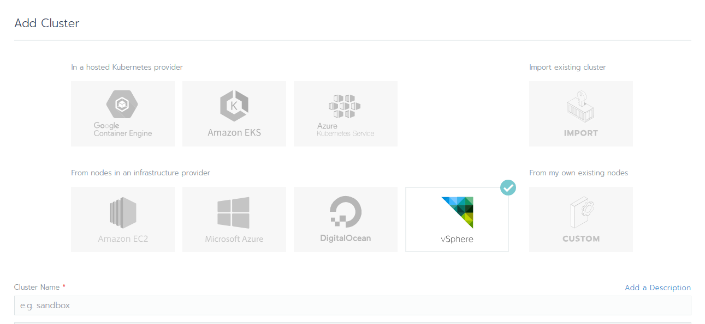
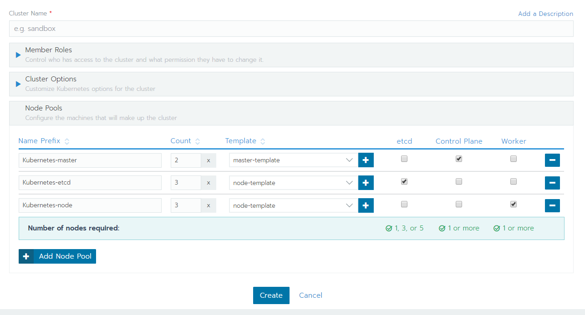
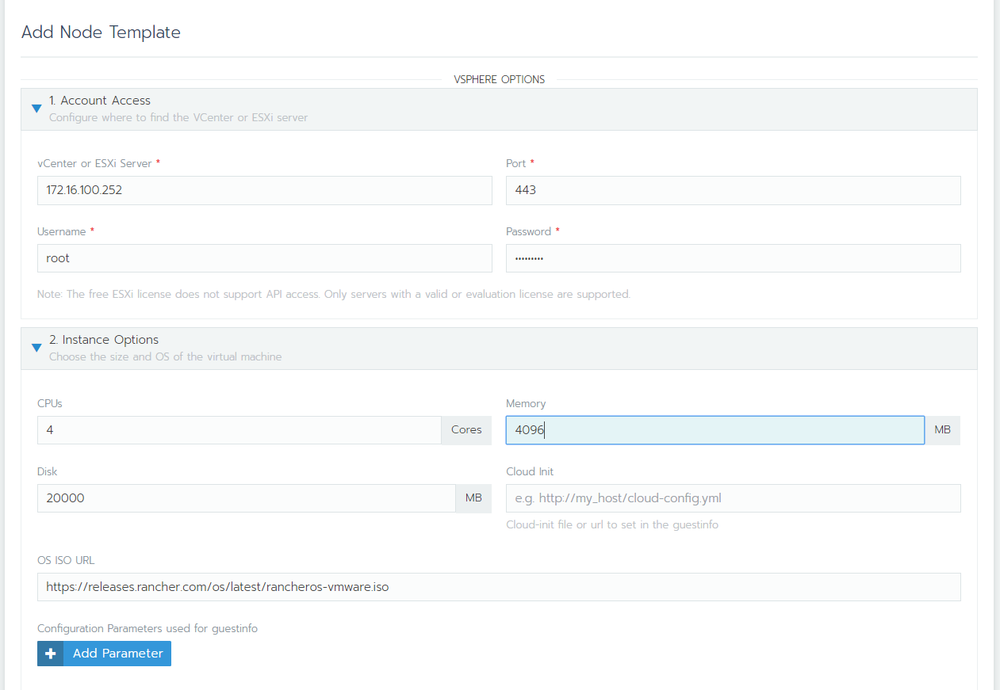
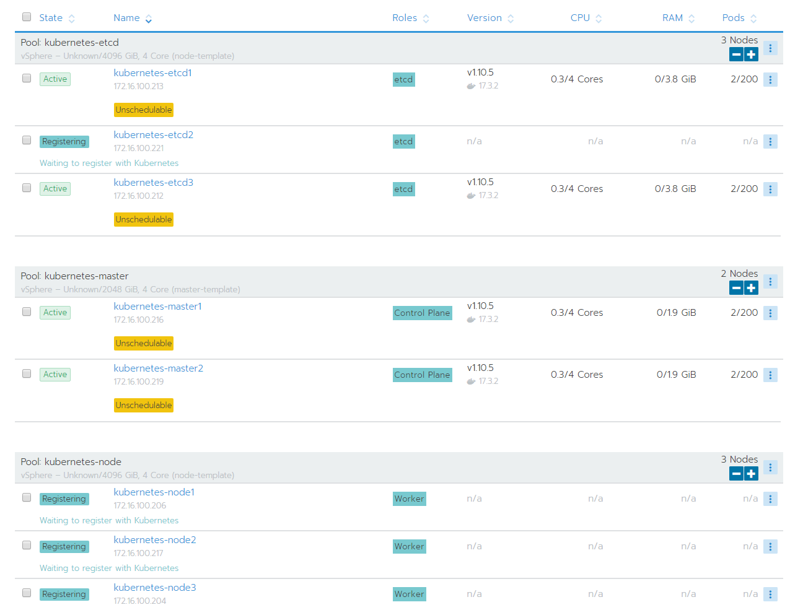

# 以 Rancher 在 ESXi 上大量部署

## Step1. 新增 Cluster

登入後，右上角 Add Cluster

## Step2. 部署設定

選 vSphere，輸入 Cluster 名稱和 Template 等設定，設定完後按下方 Create

### 新增 Template 設定

* Account Access
  * ESXi Server IP, Username, Password
* Instance Options
  * VM 規格 \(CPU, Memory, Disk\)
  * [RancherOS 設定](https://rancher.com/docs/os/v1.2/en/configuration/) \(hostname, ip, ssh-key...\) [範例](https://raw.githubusercontent.com/Zi-Shane/RancherOS-config/master/cloud-config.yml)
* Scheduling
  * Network Interface to attach VM

## Step4. 完成

等待全部變為 Active 狀態即部署完成

